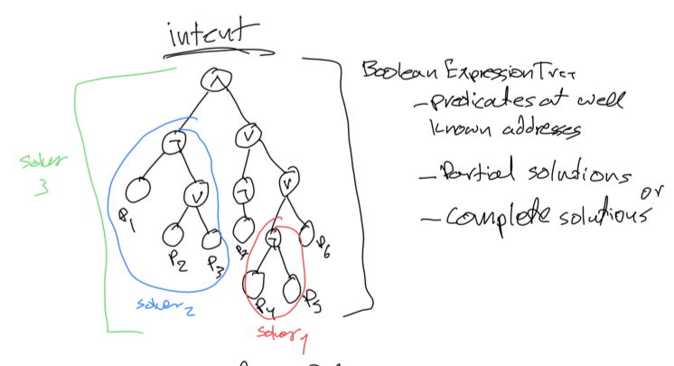

# Typhon

## State

_note: all account addresses here are encoded in base58 and are 32-bytes long_

All on-chain state is stored in accounts. Accounts are identified by 32-byte bytestrings. They all belong to a global namespace and all their content is readable to everyone through the RPC interface and by predicates. Off-chain clients use the RPC interface to query on-chain data. 

The blockchain stores accounts as instances of an [`Account`](../primitives/src/account.rs) struct:

```rust
struct Account {
  state: Vec<u8>,
  predicates: PredicateTree
}
```

Where `state` is an opaque bytestring that is application-specific and there is no general format or schema it follows. Some applications might chose certain conventions. For example if we had a token identified by an address `0xToken1USDC111111111111111` (in base58) and a user wallet identified by `0xWallet1111111111111111111111111`, then as a convention wallet's balance could be stored as a big-endian `u64` value inside `sha3(token_addr || wallet_addr)`. Client-facing apps wanting to check user's USDC balance would have to compute the wallet-derived address of the USDC token and read its contents, then interpret it as a big-endian 64-bit integer before rendering it on their mobile app.

## Predicate Trees

The `predicates` field in `Account` stores a boolean expression tree that must evaluate to `true` for a write operation to be permitted on the account state. Predicates are functions compiled to WASM bytecode and stored as a state in some account state. Their addresses are well known and the blockchain ships with a set of commonly used predicates such as `SigVerify111111111111111111`, `Equals11111111111111111`, `LessThan111111111111111111`, etc. Those predicates are part of the _standard predicate library_. Developers also have the ability to deploy their own predicates to arbitrary addresses on the chain by uploading their WASM bytecode and storing it an account.

The predicate WASM bytecode MUST export one function:

```
fn validate(context: Vec<u8>, tx: Transaction) -> bool;
```

and lives under a known address. It is invoked by the chain whenever something tries to modify some account state. For example, if we want to make some predicate's bytecode immutable after it is uploaded, then it's predicate tree would contain exactly one predicate that always returns `false`. Predicates are allowed to read all contents of any account referenced by the transaction.

The basic structure of a [`Predicate`](../primitives/src/predicate.rs) is:

```rust
struct Predicate {
  code: Address,
  params: Vec<u8>
}
```

The basic structure of a [`PredicateTree`](../primitives/src/predicate.rs) is:

```rust 
enum PredicateTree {
  Id(Predicate),
  Not(PredicateTree),
  And(PredicateTree>, PredicateTree),
  Or(PredicateTree, PredicateTree),
}
```

If we go back to the wallet USDC balance example, and we wanted to make it such that it could be spent by a 1 out of 2 MultiSig if its balance is less than 100 but 2 out of 2 sigs if the balance is equal or more than 100, then it could be expressed using the following predicate tree:

```rust
PredicateTree::Or(
  PredicateTree::And(
    PredicateTree::Id(Predicate {
      code: Address("LessThan1111111111111111111"),
      params: 10u64.to_big_endian()
      }
    ),
    PredicateTree::Or(
      Predicate {
        code: Address("SigVerify1111111111111111111"),
        params: pubkey1
      },
      Predicate {
        code: Address("SigVerify1111111111111111111"),
        params: pubkey2
      }, 
    ),
    PredicateTree::Id(
      PredicateTree::Not(
        Predicate {
          code: Address("LessThan1111111111111111111"),
          params: 10u64.to_big_endian()
        }
      )
    ),
    PredicateTree::And(
      Predicate {
        code: Address("SigVerify1111111111111111111"),
        params: pubkey1
      },
      Predicate {
        code: Address("SigVerify1111111111111111111"),
        params: pubkey2
      }, 
    ),
  )
)
```

Where `LessThan1111111111111111111` points to some account that has WASM bytecode exporting the predicate function. `10u64` is the value of the first `context` param, `tx` is the content of the transaction that is requesting the change, `old_state` is the state of the account prior to its state mutation and `new_state` is the desired state.

## Intents and Validity Predicate

Predicate trees can be used to express both validity predicates that guard account state mutation as well as intents (partial transactions). Solvers look for intents that they know how to parse and solve and provide solutions in form of new state mutation. A solution + intents together make up a _transaction_. For a transaction to succeed and change account state all mutated accounts state must have their predicates tree evaluate to `true` *and* the intents predicate tree must evaluate to true as well. In other words a mutation is permitted when `validity_predicates && intents == true`.

## Solvers and Predicate Queries

The fact that predicates logic is stored under well-known immutable addresses, and they ship with documentation that explains the parameters format they accept, solvers can easily filter intents that they understand and skip intents or transactions touching validity predicates that they don't understand by looking for trees or subtrees with some pattern. Solvers may be able to provide partial solutions to intents if they understand a subtree in a larger intents tree. For example if the solver recognizes that a certain subtree of a larger intents tree represents a token swap predicate tree, they could provide a partial solution to it by replacing the entire matched subtree with a partial solution. This enables composability between solvers and their specialization.

Here you can see an example of solver that understands a large and complex predicate tree (solver 3). Those types of solvers are most likely very specialized applications, such as poker games, DAOs, etc. The intents tree has subtrees that are also understood by other solvers, such as solver 1 (small subtree, so most likely a simple transfer), or solver 2 (medium sized tree so most likely a swap).

